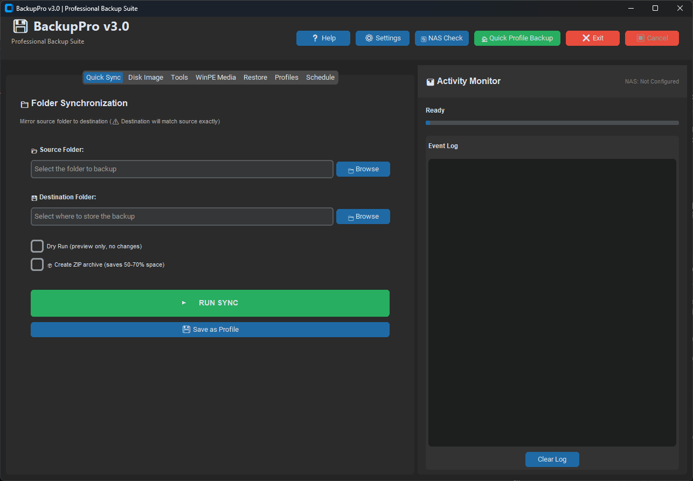

# BackupPro

A free, all-in-one Windows backup toolkit with a modern GUI: folder mirroring, full disk images, restore scripts, bootable WinPE recovery media, scheduling, and phone notifications when a job finishes.

> Built by a working IT technician to make client and home-lab backups painless. Free to use, free to change.

## Screenshots


*Quick Sync tab: mirror a folder, save it as a profile, watch the activity monitor*

## Features

- **Quick Sync** - mirror a folder with robocopy; dry-run preview, optional ZIP archive
- **Disk Image** - full system images via Windows Backup (`wbadmin`) with retention (keep last N)
- **Restore** - restore scripts for DISM, installed apps and environment settings
- **WinPE Media** - build a bootable recovery ISO/USB that carries BackupPro and a recovery menu
- **Profiles** - save and re-run backup jobs; **Schedule** them with Windows Task Scheduler
- **NAS support** - back up to network (UNC) shares with saved credentials and a NAS online check
- **Notifications** - email, SMS (via carrier email gateways) and [ntfy](https://ntfy.sh) push alerts
- **Verification, dedup and encryption options** - see [docs/FEATURES.md](docs/FEATURES.md) for the full list

## Requirements

- Windows 10 / 11 (run as Administrator for disk imaging)
- Python 3.9+ if running from source
- Optional: [Windows ADK](https://learn.microsoft.com/en-us/windows-hardware/get-started/adk-install) for building WinPE media

## Quick start

```powershell
git clone https://github.com/ronaldgoodchild/backuppro.git
cd backuppro
pip install -r requirements.txt
python backuppro.py
```

## Documentation

- [Installation guide](docs/INSTALLATION.md)
- [Complete feature list](docs/FEATURES.md)
- [User manual (HTML)](docs/manual.html) - download and open in your browser

## Security

NAS and email passwords are stored in **Windows Credential Manager** (service `BackupPro`), not in `backup_config.json`. A plain-text config from an older version is migrated automatically on first launch. If the `keyring` package is missing the app logs a warning and falls back to plain text rather than losing your settings. Never share `backup_config.json` or your logs - they contain paths and server addresses.

## Contributing

Bug reports, ideas and pull requests are welcome - see [CONTRIBUTING.md](CONTRIBUTING.md) and [ROADMAP.md](ROADMAP.md). Look for issues labelled `good first issue`.

## License

[MIT](LICENSE) (c) 2026 Ronald Goodchild / REGTeches
